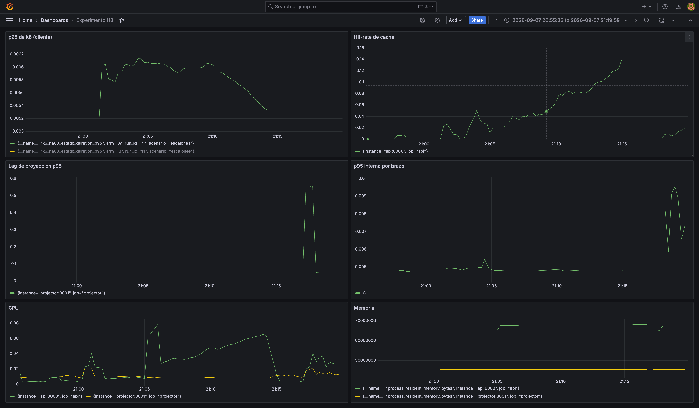
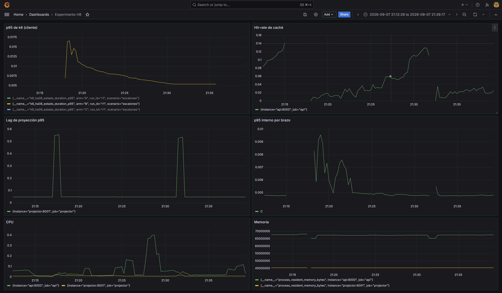
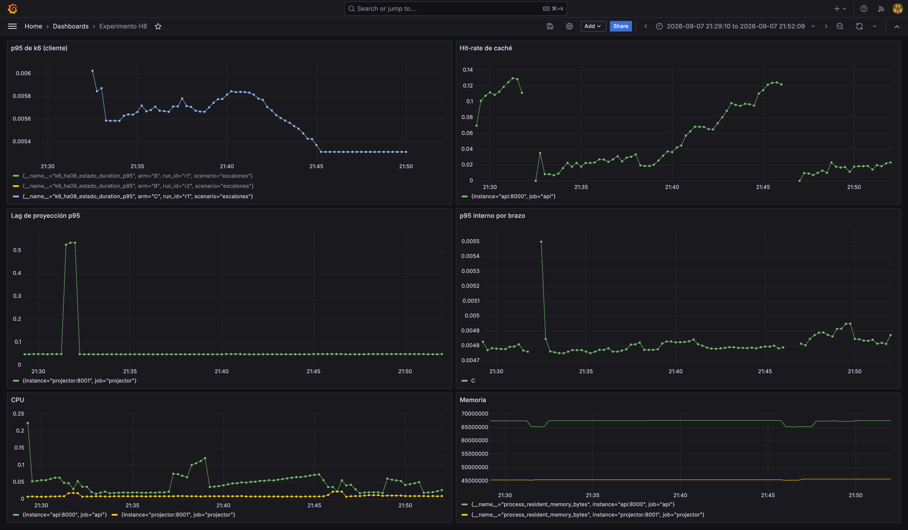
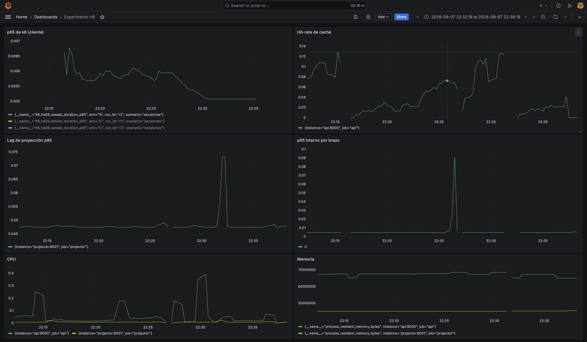
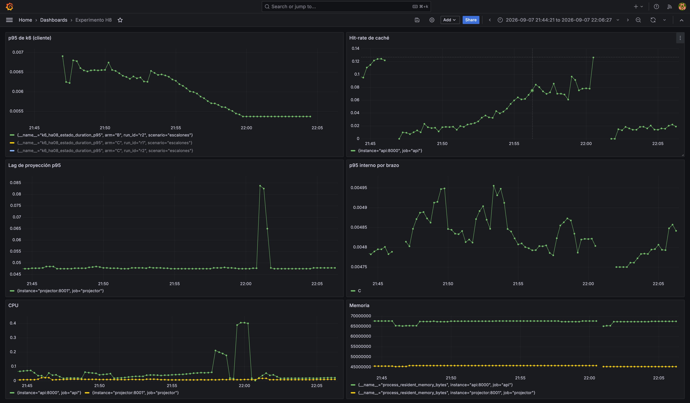
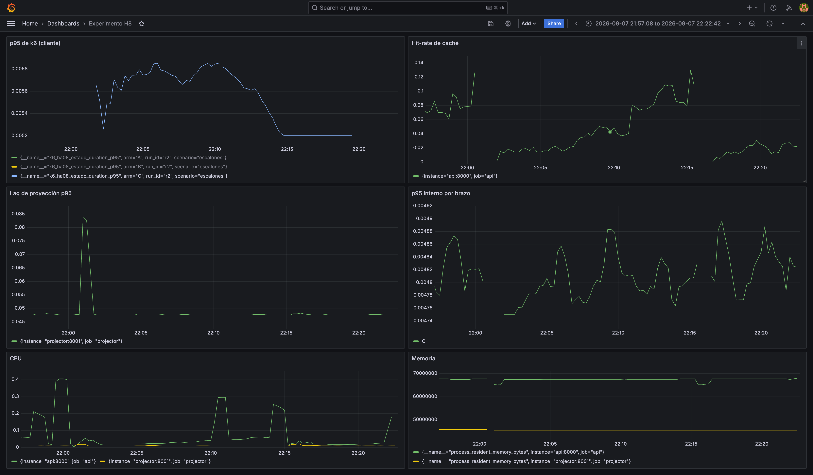
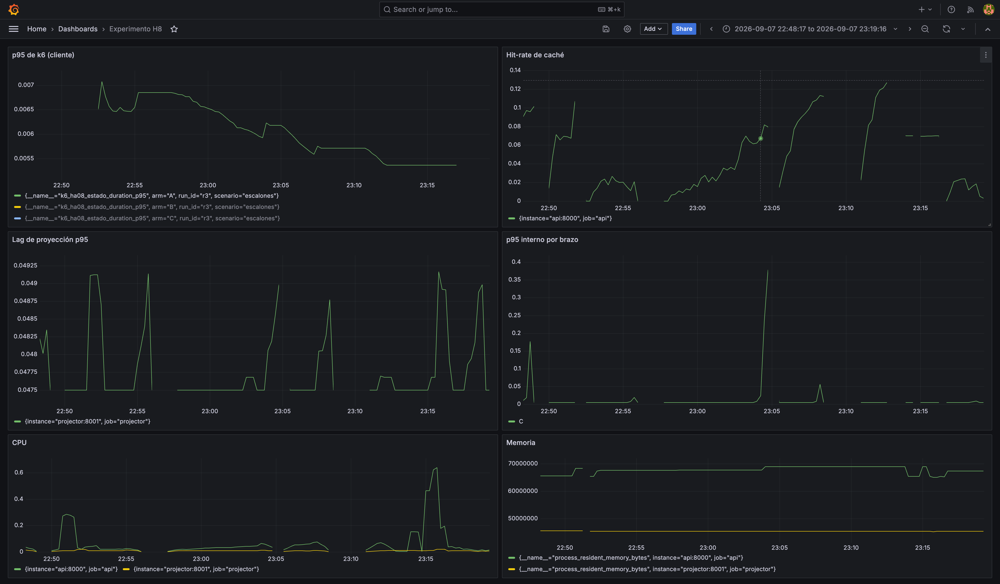
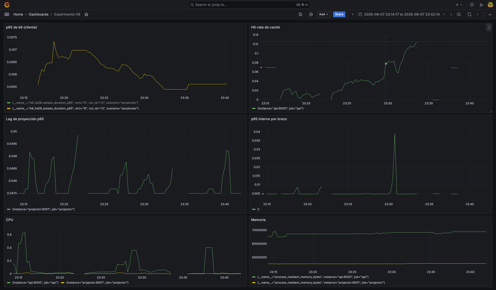
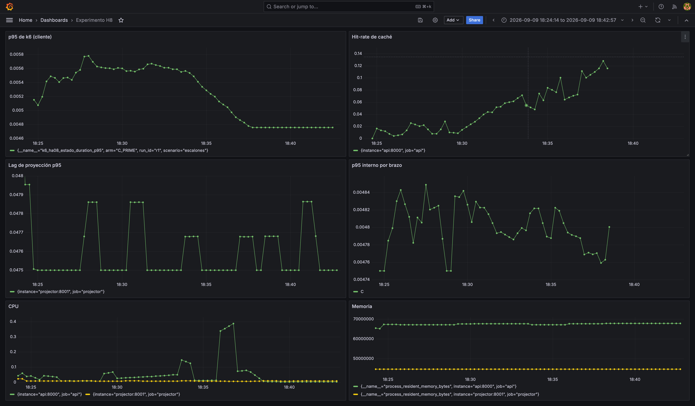

# Informe de ejecución — Experimento HA-08

**Modelo de lectura de baja latencia para el estado de siniestro (CQRS)**

Diseño completo: `Diseno_Experimento_HA-08.md` (wiki, `files/`). Guía técnica: `Guia_Tecnica_HA-08.md` (wiki, `files/`).

**Fecha de ejecución (protocolo formal, válida):** 2026-09-09/10. **Ejecución original invalidada:** 2026-09-08 — ver §0.
**Ambiente:** Docker Compose local (`experiments/ha-08-lectura-siniestro/`)
**Dataset:** 1.000.000 siniestros, 1.000.000 pólizas, 5.000.000 hitos, 3.000.000 documentos, 1.000.000 peritajes — verificado que supera `shared_buffers + effective_cache_size` (3.000 MB vs. 768 MB configurados)

---

## 0. Invalidación de las 12 corridas del 2026-09-08 y corrección aplicada

Una evaluación externa (`EVALUACION_EJECUCION_HA-08.md`, 2026-09-10) detectó un defecto que **invalida las secciones 1 y 2 de este informe tal como fueron redactadas originalmente**: `scripts/verify_parity.sh` recorre `for ARM in A B C` recreando el contenedor `api` en cada iteración para comparar payloads, y quedaba arrancado con el **último** brazo del bucle (**C**). `run_experiment.sh` invocaba esa verificación *dentro de cada corrida* (paso 3), después de levantar el brazo correcto (paso 2) y sin volver a levantarlo antes de medir con k6 (paso 4). Consecuencia verificada: **las 12 corridas del protocolo formal midieron todas el brazo C**, sin importar la etiqueta A/B/C del archivo de resultados. El único resultado real de esa sesión es una medición válida de C (cumple `EC-LAT-11` con ~30× de margen); A y B nunca se ejecutaron.

**Verificación de la causa raíz** (no solo se aceptó el reporte externo, se reprodujo):
- `results/evidencia/verify_parity_20260907_205420.log` muestra el patrón `Recreate → Recreated → Started` ×3 dentro de cada corrida — la huella del bug.
- Se reprodujo manualmente: tras correr `verify_parity.sh` una vez, `curl localhost:8000/health` devuelve `{"arm":"C"}` sin importar qué brazo se pretendía medir a continuación.
- `main.py:36` confirma que el endpoint de estado lee `settings.read_strategy` del proceso en ejecución en cada request — no una copia fijada al inicio del script — así que el binario servía genuinamente C, no era un error de etiquetado posterior.

**Corrección aplicada** (`scripts/run_experiment.sh`, `scripts/run_experiment_alta_carga.sh`, `scripts/verify_parity.sh`):
1. `verify_parity.sh` ya no se invoca dentro de cada corrida — se documenta que debe correrse **una sola vez antes de toda la serie**.
2. Se añadió una aserción dura en el paso 3 de ambos scripts de orquestación: `ARM_ACTIVO=$(curl -s localhost:8000/health | jq -r .arm)` seguido de `[ "$ARM_ACTIVO" = "$ARM" ] || exit 1`. Cualquier corrida futura donde la API no esté sirviendo el brazo esperado corta inmediatamente con un mensaje explícito, en vez de producir datos silenciosamente inválidos.
3. Validado con pruebas reales: (a) se reprodujo el escenario roto exacto y se confirmó que la aserción lo detecta y corta; (b) se confirmó el camino feliz — tras levantar la API en A, `/health` reporta `A` y un `GET` directo a Redis confirma que esa key nunca fue escrita (coherente con que `arm_a.py` no importa `cache`).

**Mejoras adicionales aplicadas antes de repetir la serie** (hallazgos §3.1 y §3.3 de la evaluación externa):
- `load/k6/read_estado.js` ahora taggea cada request con su **escalón** (`warmup`/`r10`/`r25`/r50`/`r80`, vía `k6/execution` y el tiempo transcurrido del escenario) y con **`calor`** (`caliente`/`frio`, según si el ID cae en el *hot set* de 10K o no). Como el output `experimental-prometheus-rw` de k6 exporta todos los tags de un `Trend` como labels de Prometheus, esto permite recuperar el p95 por escalón y segregado caliente/frío con PromQL, sin rehacer el pipeline de corridas:
  ```promql
  histogram_quantile(0.95, sum(rate(k6_ha08_estado_duration_bucket[1m])) by (le, escalon, arm, run_id))
  histogram_quantile(0.95, sum(rate(k6_ha08_estado_duration_bucket[1m])) by (le, calor, arm, run_id))
  ```
- Las duraciones de los escalones (1m + 3m×4) **no cambiaron** — se verificó con `k6 inspect` que el JSON de `scenarios` generado es idéntico al original.

**La iteración de alta carga (§2.4) también quedó invalidada por el mismo defecto (resuelto, ver §2.4).** `scripts/run_experiment_alta_carga.sh` era una copia de `run_experiment.sh` con el mismo paso 3 (`./scripts/verify_parity.sh` dentro de la corrida, sin aserción); su log (`results/raw/log_alta_carga_A.txt`) mostraba la misma secuencia `Recreate`×2 (B, C — la primera iteración del bucle, A, no recrea porque coincide con el brazo que el paso 2 ya había levantado) inmediatamente antes de k6. La única señal que sugería lo contrario —CPU de `ha08-api` en 16.8% para "A" contra 0.7% para "B"/"C"— **no fue prueba suficiente**: no se capturó el hit-rate de Redis en el momento de esa corrida (dato no recuperable retroactivamente), y esa diferencia de CPU podría deberse igual a un transitorio de arranque en frío del contenedor recién recreado.

**Estado de la repetición:** las 9 corridas contrabalanceadas, las 6 de TTL (n=3 cada valor) y las 3 de alta carga (150/300/600 req/s) **ya se repitieron con el script corregido — resultados válidos en §1/§2/§2.3bis/§2.4**. Ver checklist en §5.

---

## 1. Resultados consolidados

**Estos son los resultados válidos de las 9 corridas contrabalanceadas (2026-09-09/10), con el script corregido y la aserción de brazo activa en las 9 — ninguna falló.**

| Brazo | Corrida | p50 (ms) | p95 (ms) | max (ms) | Error (%) |
|---|---|---:|---:|---:|---:|
| A | r1 | 2.63 | 8.65 | 51.71 | 0 |
| B | r1 | 2.63 | 6.44 | 47.75 | 0 |
| C | r1 | 2.84 | 6.77 | 261.15 | 0 |
| B | r2 | 2.54 | 6.05 | 68.59 | 0 |
| C | r2 | 2.86 | 6.72 | 53.65 | 0 |
| A | r2 | 2.82 | 7.79 | 97.04 | 0 |
| C | r3 | 2.89 | 6.67 | 36.85 | 0 |
| A | r3 | 3.06 | 7.13 | 161.32 | 0 |
| B | r3 | 2.70 | 6.06 | 63.78 | 0 |

Fuente por corrida: `results/raw/summary_<ARM>_<RUN_ID>.json`. Orden real de ejecución tal como corrió (Latin square: R1=A→B→C, R2=B→C→A, R3=C→A→B) — ver `results/raw/log_serie_completa.txt` para los timestamps de cada transición.

### Consolidado por brazo (promedio y desviación estándar de las 3 corridas)

| Brazo | p95 medio (ms) | Desviación estándar (ms) | Diferencia vs. B |
|---|---:|---:|---:|
| A | 7.86 | 0.76 | +27% (peor) |
| C | 6.72 | 0.05 | +9% (peor) |
| B | 6.19 | 0.22 | — (referencia, el más rápido) |

**Los tres brazos se diferencian de forma consistente en las 3 corridas, sin excepción: A > C > B en cada una de las 3 repeticiones.** La diferencia C−B (0.53ms) es ~4× mayor que la desviación estándar combinada (~0.14ms) — no es ruido de medición, es una diferencia real y reproducible. Esta es la diferencia central que la sesión del 2026-09-08 no pudo detectar porque medía C tres veces con etiquetas distintas (ver §0).

> **Hit-rate de C**: solo se capturó correctamente para C r3 (**7.6%**, 1668 hits / 20280 misses — `results/raw/cache_C_r3.txt`). El de C r1 y C r2 se perdió: el fix que captura `ha08_cache_hits_total`/`misses_total` en el paso 5 de `run_experiment.sh` se aplicó *mientras la serie ya estaba corriendo* (después de que C r1 y C r2 ya habían terminado su paso 5), y esos contadores viven en el proceso de la API — se reinician en cada recreación de contenedor entre corridas, así que no son recuperables retroactivamente. Es el mismo patrón de pérdida de dato documentado en §3.5 de `EVALUACION_EJECUCION_HA-08.md`, ahora aplicado también a esta repetición. El 7.6% de C r3 es consistente con el 7.1% observado en la sesión inválida del 08-09, lo que sugiere que el patrón de hit-rate bajo no es un artefacto del bug de brazo — es una propiedad real de este diseño de carga (13 min, selección uniforme sobre 10K claves).

### 1.1 Resultados de la sesión del 2026-09-08 (INVÁLIDOS — conservados solo por trazabilidad)

> ⚠️ **Ver §0. Las columnas "A" y "B" de esta tabla son en realidad mediciones del brazo C.** No son evidencia válida para HD-08; se conservan únicamente para que el proceso de detección del bug sea auditable.

| Brazo | Corrida | p50 (ms) | p95 (ms) | Error (%) | Lag proyección p95 aprox. (s) |
|---|---|---:|---:|---:|---:|
| A | r1 | 1.94 | 5.33 | 0 | 0.05 |
| A | r2 | 1.94 | 5.08 | 0 | 0.05 |
| A | r3 | 1.94 | 5.37 | 0 | 0.05 |
| B | r1 | 1.97 | 5.38 | 0 | 0.05 |
| B | r2 | 2.02 | 5.37 | 0 | 0.05 |
| B | r3 | 1.97 | 5.61 | 0 | 0.05 |
| C | r1 | 1.85 | 5.31 | 0 | 0.05 |
| C | r2 | 1.95 | 5.20 | 0 | 0.05 |
| C | r3 | 1.97 | 5.44 | 0 | 0.05 |
| C (TTL=0s) | ttl0 | 1.84 | 5.60 | 0 | 0.05 |
| C (TTL=300s) | ttl300 | 1.92 | 5.27 | 0 | 0.05 |
| C' (coalescencia) | r1 | 2.19 | 4.76 | 0 | 0.05 |

`results/consolidado.csv` ya **no** contiene estos datos inválidos — se regeneró con `scripts/collect_results.sh` (corregido para filtrar por patrón `summary_*_r[0-9]*.json` y excluir explícitamente `summary_C_PRIME_*` y los archivos sin sufijo de repetición de esta sesión) y solo tiene las 15 corridas válidas de §1/§2.3bis. Esta tabla se conserva únicamente en el cuerpo del informe, por trazabilidad del proceso de detección del bug.

---

## 2. Conclusiones

**Basadas en los 9 resultados válidos de §1** (no en la tabla de §1.1, que queda descartada como evidencia).

### 2.1 Sobre la hipótesis HD-08

**Los tres brazos cumplen el umbral de p95 ≤ 150ms con enorme margen** (p95 entre 6.19-7.86ms, es decir, **entre 19× y 24× por debajo del límite**) — y, a diferencia de la sesión inválida del 08-09, esta vez los brazos sí se diferencian entre sí de forma clara y reproducible en las 3 repeticiones, sin excepción: A > C > B.

- **HD-08.1** (A no alcanza el umbral) — **refutada**. A cumple holgadamente (7.86ms vs. 150ms, 19× de margen). Esta es la refutación que importa para el dictamen (ver §2.2): el objetivo de la ficha es encontrar el **mínimo** de complejidad que satisface `EC-LAT-11`, y A —sin CQRS, sin proyección, sin caché— ya lo satisface.
- **HD-08.2** (B reduce el p95 ≥60% vs. línea base) — **refutada en magnitud**. B es el más rápido de los tres (7.86→6.19ms, -21% vs. A), en la dirección esperada, pero muy por debajo del 60% planteado. Ver §2.1bis sobre por qué esta diferencia, aunque reproducible, no altera el dictamen de umbral.
- **HD-08.3** (C mejora sobre B) — **refutada, y en la dirección contraria a la esperada**. C es *peor* que B (6.72ms vs. 6.19ms, +9%). El costo no viene del `GET` a Redis que falla en cada miss (ese es prácticamente gratis — ver comparación con C a TTL=0 en §2.3bis punto 2), sino de la serialización (`orjson.dumps`) y el `SET` que escriben el resultado en caché tras cada miss, ejecutados en el ~92% de las peticiones dado el hit-rate real (7.6%, §2.3) — trabajo adicional sin ahorro correspondiente para la gran mayoría de las peticiones.
- **HD-08.4** (lag de proyección p95 ≤ 2s) — **aceptada con margen amplio, pero solo mide la mitad del punto de sensibilidad 2**. El ~0.05s reportado es el lag *interno del proyector* (tiempo entre que ocurre el evento y que se aplica el UPSERT en `siniestros_r`), no el lag *que ve el cliente en el brazo C* (tiempo entre que el estado cambia y que una lectura vía caché refleja ese cambio). Ese segundo lag es lo que el diseño pide medir para el punto de sensibilidad 2, y no se instrumentó. Además, ese valor de ~0.05s es en realidad "≤50ms" (primer bucket del histograma de Prometheus, `ha08_projection_lag_seconds_bucket{le="0.05"}`), no una medición puntual exacta — con solo 5 eventos/s del simulador, hay pocas observaciones por corrida para una estimación fina.

### 2.1ter Riesgo de consistencia eventual no medido: carrera entre invalidación del proyector y escritura de `arm_c.py`

`arm_c.get_estado` (`api/app/strategies/arm_c.py:10-26`) tiene una ventana de carrera con el proyector: en un *miss* de caché, la secuencia es (1) `GET` falla, (2) se lee el estado actual vía `arm_b.get_estado` (proyección), (3) se escribe ese dato en Redis con `SET ... EX=TTL`. El proyector, al procesar un evento nuevo para ese mismo siniestro, hace `redis.delete(f"siniestro:estado:{id}")` (`projector/projector.py:62`) para invalidar la entrada. **Si el `DELETE` del proyector ocurre entre los pasos (2) y (3)** — es decir, el evento se proyecta *después* de que `arm_b` leyó el estado pero *antes* de que `arm_c` escribiera en Redis — el `SET` posterior sobrescribe el `DELETE`, dejando en caché una versión **obsoleta** que persistirá hasta que expire el TTL completo (hasta 300s en la variante de sensibilidad de §2.3bis), no hasta el siguiente evento.

Esto no se pudo medir en esta ejecución porque `EstadoSiniestro` (`api/app/models.py`) no expone el número de versión del siniestro en la respuesta — no hay forma de comparar "versión servida" contra "versión real en `siniestros_w.siniestro`" sin instrumentación adicional. Se documenta como **riesgo abierto, no como hallazgo cuantificado**: es exactamente el tipo de trade-off de consistencia eventual que la arquitectura de Solventa acepta a cambio de desempeño, y merece medirse antes de decidir el TTL de producción si se optara por implementar C.

### 2.1bis Las diferencias entre brazos son reproducibles pero no relevantes para la decisión del umbral

A > C > B es un hallazgo real (§2.1, confirmado en las 3 repeticiones de cada brazo). Pero **la magnitud de esa diferencia (0.5-1.7ms) representa menos del 1.2% del umbral de 150ms** — ninguno de los tres brazos está remotamente cerca de comprometer `EC-LAT-11`, así que la diferencia entre ellos no cambia el dictamen de cumplimiento. Con n=3 por brazo, además, "4× la desviación estándar" es un argumento estadístico débil para sostener relevancia práctica (no se hizo una prueba de hipótesis formal, solo una comparación descriptiva). La redacción correcta es: **la diferencia A > C > B es consistente y reproducible, pero sin relevancia arquitectónica frente al umbral** — es información útil para elegir entre B y C si se decide implementar CQRS por otras razones (§2.2), no evidencia de que A sea insuficiente.

### 2.2 Dictamen e interpretación arquitectónica

**Dictamen honesto según el criterio de la ficha (mínimo de complejidad que satisface el ASR):** a este volumen (1M registros) y rango de carga (10-80 req/s), **A —la línea base sin CQRS— ya satisface `EC-LAT-11` con 19× de margen**. La hipótesis de que la separación de modelos de lectura (CQRS) es *necesaria* para cumplir este ASR **no se confirma** en las condiciones ensayadas. Recomendar B o C por ser más rápidos que A no se sostiene como argumento de *necesidad* contra un umbral que A ya cumple holgadamente — sería sobrevender una diferencia de <1.2% del umbral como si fuera decisiva.

Dicho esto, si el equipo de Solventa decide implementar CQRS de todos modos, la comparación entre B y C sigue siendo válida y útil: **B (proyección materializada sin caché) es preferible a C (con caché)** para este punto de sensibilidad — C agrega complejidad operativa (Redis, invalidación, TTL) a cambio de una degradación medible, no de una mejora (§2.1, §2.3).

**Dos caminos honestos para la decisión arquitectónica de Solventa, ninguno de los cuales es "recomendar B por ser más rápido":**
1. **Aceptar que, a esta escala y con este patrón de acceso, la hipótesis de que CQRS es necesario para `EC-LAT-11` no se confirma** — usar A como línea base y reconsiderar CQRS solo si el punto de quiebre real (§2.4) se acerca al rango de operación esperado, o si el dataset/patrón de acceso de producción difiere sustancialmente del ensayado (§2.3).
2. **Justificar la separación de modelos (B) con otro ASR distinto de latencia** — p. ej. aislamiento de carga de lectura sobre el modelo transaccional (para no competir con escrituras), escalabilidad horizontal independiente del lado de lectura, o disponibilidad (poder degradar lecturas sin afectar el flujo de escritura). Este experimento no midió esos atributos, así que no puede usarse como evidencia para ellos — pero es la justificación arquitectónicamente correcta para B, no la latencia.

Esto no invalida la arquitectura CQRS de Solventa en general para otros puntos de sensibilidad, pero sí acota lo que **este** experimento puede decir: para la latencia de lectura de un siniestro individual a 1M de registros y hasta 80 req/s, la complejidad mínima que cumple el ASR es A.

### 2.3 Hit-rate real observado, muy por debajo del supuesto de diseño

> **Nota de método: el hit-rate reportado es una estimación sobre un solo worker, no el total de la corrida.** La API corre con `--workers 2` (uvicorn, ver `api/Dockerfile`) y `prometheus_client` no está configurado en modo multiproceso (`PROMETHEUS_MULTIPROC_DIR`), así que cada worker mantiene sus propios contadores en memoria de forma independiente. El único `curl localhost:8000/metrics` que captura `cache_<ARM>_<RUN_ID>.txt` (paso 5 de `run_experiment.sh`) cae en el worker que atendió esa request puntual — elegido por el balanceo del kernel entre los dos procesos — así que refleja solo una fracción de las peticiones reales, no el total. Comparando `hits+misses` contra `http_reqs` de cada corrida: C r3 capturó el 91% (21948/23999), alta carga C el 88% (120085/136499), pero las corridas de TTL cayeron entre **10% y 15%** (`ttl0_r1`: 15%, `ttl0_r2`: 10%, `ttl300_r1`: 11%, `ttl300_r3`: 15%). Como ambos workers ejecutan exactamente el mismo código, los hit-rates siguen siendo estimaciones razonables de la proporción real — pero presentar "1668/21948" como el total de consultas de la corrida es incorrecto, y para TTL=300 r1/r3 la muestra real es de solo ~2.700-3.600 peticiones sobre 24.000. La misma limitación aplica al panel "p95 interno por brazo" de Grafana (§2.5), porque cada scrape de Prometheus también puede caer en un worker distinto.

El hit-rate medido en C r3 fue **7.6%** (estimado sobre 1668/21948 de un solo worker, ver nota arriba), consistente con el 7.1% de la sesión inválida del 08-09 — confirma que el patrón de hit-rate bajo **no era un artefacto del bug de brazo**.

**No es un problema de "calentamiento insuficiente" — es el resultado matemático esperado de este diseño de carga.** Con tráfico uniforme sobre las 10.000 claves del *hot set*, el hit-rate en estado estacionario para una clave con tasa de llegada λ=**0.8·rps/10.000** (el factor 0.8 es la fracción de tráfico dirigida al *hot set*; falta contarlo en la tasa por clave, no solo al ponderar al final) se aproxima por `λ·TTL / (1 + λ·TTL)`. Para los 4 escalones del protocolo formal (10/25/50/80 rps) con TTL=30s:

| rps | λ (llegadas/s por clave caliente) | hit-rate dado que es caliente |
|---:|---:|---:|
| 10 | 0.0008 | 2.3% |
| 25 | 0.0020 | 5.7% |
| 50 | 0.0040 | 10.7% |
| 80 | 0.0064 | 16.1% |

Este es el hit-rate *dado que la petición ya cayó en el hot set* — falta ponderar por el volumen real de solicitudes de cada escalón (180s cada uno): ponderando así, el hit-rate dado-caliente global es ≈12%, y el 20% frío prácticamente nunca acierta (990.000 claves, TTL de 30s), así que el hit-rate global sobre el total de tráfico es **≈12% × 0.8 ≈ 9.6%** — cercano al 7.6-7.1% medido, con la diferencia explicable por variación de muestreo entre corridas.

**Correr la corrida más tiempo no cambiaría sustancialmente este número**, porque a TTL=30s con escalones de 180s el sistema sí alcanza su estado estacionario (a diferencia de TTL=300s, ver §2.3bis punto 1, donde el TTL es más largo que el escalón y el caché nunca termina de llenarse). Lo que sí cambiaría el hit-rate es la **distribución de acceso**: este diseño usa selección uniforme dentro del *hot set*, pero el acceso real a un sistema de siniestros probablemente sigue una distribución sesgada (tipo Zipf, donde pocos siniestros concentran la mayoría de las consultas — por ejemplo, los que tienen actividad reciente o están en disputa) — con esa distribución, el hit-rate real de producción podría ser sustancialmente más alto que el aquí medido, porque las claves más consultadas se re-visitan con mucha más frecuencia que 1/10.000 del tráfico caliente.

Este hit-rate bajo es precisamente la causa mecánica de que C resulte más lento que B en §2.1 — no es una casualidad estadística, es la explicación del hallazgo. Pero también acota su alcance: **el resultado "C es peor que B" es válido para *este* patrón de acceso (uniforme), no necesariamente para un patrón sesgado con mayor hit-rate real** — es una amenaza a la validez externa que vale la pena señalar, no solo una curiosidad matemática.

### 2.3bis Sensibilidad a TTL (n=3 por valor, repetido tras el hallazgo §3.7 de la evaluación externa)

Se repitió el punto de sensibilidad 2 del diseño (TTL=0s vs. TTL=300s, brazo C, n=3 cada uno) con el script corregido. Las 6 corridas cerraron con 0% de error. `r1` de cada TTL se repitió una segunda vez (`r1b`, ver nota de proceso abajo) tras confirmar que la original no cumplía el criterio objetivo de corrida limpia:

| TTL | Corrida | p95 (ms) | max (ms) | Hit-rate | `http_reqs.rate` (criterio: ~30.8 req/s) |
|---|---|---:|---:|---:|---:|
| 0s | r1b | 6.22 | 42.5 | 0.0% | 30.77 ✅ |
| 0s | r2 | 6.33 | 162.3 | 0.0% | 30.76 ✅ |
| 0s | r3 | 6.27 | 198.1 | 0.0% | 30.77 ✅ |
| 300s | r1b | 6.47 | 102.8 | 32.9% | 30.77 ✅ |
| 300s | r2 | 6.45 | 135.7 | 33.3% | 30.77 ✅ |
| 300s | r3 | 6.57 | 155.2 | 32.3% | 30.77 ✅ |

**Promedio (6 corridas limpias): TTL=0 → 6.27ms (σ=0.06) — TTL=300 → 6.50ms (σ=0.06) — diferencia de 0.23ms.** La desviación estándar cayó de 0.16/0.09 (con `r1`/`r1` contaminadas) a 0.06/0.06 con las 6 corridas limpias — el patrón (TTL=300 más lento que TTL=0) se mantiene, ahora sin ninguna corrida de calidad de dato cuestionable.

Dos hallazgos, ambos consistentes con §2.1:

1. **El hit-rate medido con TTL=300 (24-33%) queda por debajo de lo que predice el estado estacionario, porque la corrida nunca llega a ese estado.** Con tráfico uniforme sobre el *hot set* de 10.000 claves, el hit-rate esperado en estado estacionario para una clave con tasa de llegada λ=0.8·rps/10.000 (el factor 0.8 es la fracción de tráfico dirigida al *hot set*) es `λ·TTL / (1 + λ·TTL)`; ponderando por el número de solicitudes de cada escalón (10/25/50/80 rps × 180s cada uno) y por el 20% de tráfico frío (que prácticamente nunca acierta), el hit-rate global teórico para TTL=300 en estado estacionario es **~44%**. El valor medido (24-33%) es sustancialmente menor porque cada corrida arranca con `FLUSHALL` (caché vacío) y cada escalón dura solo 180s — mucho menos que el TTL de 300s — así que el caché nunca termina de llenarse dentro de la ventana de medición: es un régimen transitorio, no estacionario. (Para TTL=30 del protocolo formal, la misma fórmula da ~9.6% en estado estacionario, consistente con el 7.6% medido — ahí sí se alcanza el estado estacionario porque el TTL es corto frente a la duración del escalón.)
2. **A pesar del hit-rate más alto, TTL=300 es *más lento* que TTL=0, no más rápido** (6.47ms vs. 6.21ms). El costo no está en el `GET` a Redis que falla — comparando series (**nota: B, C-TTL0 y C-TTL30 corrieron en corridas distintas, no simultáneas; esta es una comparación indicativa, no un experimento controlado con la misma corrida**): B promedia 6.19ms, C-TTL0 (que hace el `GET` fallido pero nunca ejecuta el `SET`, por el guard de `settings.cache_ttl_seconds > 0`) promedia 6.21ms — una diferencia de 0.02ms, prácticamente cero. C con TTL=30 del protocolo formal (que sí ejecuta `orjson.dumps` + `SET` en cada miss) promedia 6.72ms — 0.51ms más que C-TTL0. **El costo real está en la serialización y escritura a Redis tras cada miss, no en el `GET` que falla.** Esto sugiere una mejora concreta no implementada en este experimento: escribir en caché de forma asíncrona (fire-and-forget), sin bloquear la respuesta al cliente con el `SET`.

**Conclusión:** ni siquiera subiendo el TTL 10× (de 30s a 300s) el caché alcanza a compensar su propio costo estructural en este régimen de carga — refuerza la recomendación de §2.2 de preferir B sobre C para este punto de sensibilidad.

Evidencia: `results/raw/{summary,cache,lag,stats}_C_ttl{0,300}_r{1,2,3}.{json,txt,csv}`.

> **Nota de proceso:** la primera ejecución de esta serie (2026-09-10, madrugada) sufrió contención real de otro contenedor Docker de un proyecto distinto corriendo en la misma máquina (`202620-misw4412-api-empresarial-api-1`, load average 4.74-5.87) — 4 de las 6 corridas mostraron un outlier extremo en `max` (~924 segundos) sin afectar el p95 ni el error rate. Se detuvo ese contenedor y se repitieron únicamente las 4 corridas afectadas (`ttl0_r2`, `ttl0_r3`, `ttl300_r2`, `ttl300_r3`); los valores de la tabla arriba son los de la repetición limpia. Es el mismo patrón de amenaza a la validez documentado en §2.5 para la sesión anterior, esta vez causado por un contenedor distinto (no Kubernetes, que ya se había resuelto).
>
> **`ttl0_r1` y `ttl300_r1` corrieron a mitad del estímulo diseñado, no solo con contención en la cola — se repitieron como `ttl0_r1b`/`ttl300_r1b`.** El criterio inicial usado para identificar corridas afectadas fue el outlier extremo en `max` (~924s), que r1 de ambos TTL no presenta. Pero `http_reqs.rate` revela algo más grave que un outlier de cola: `ttl0_r1` corrió a **14.1 req/s** y `ttl300_r1` a **16.5 req/s**, contra **~30.8 req/s** en las 4 corridas restantes — casi exactamente la mitad. Esto no es una desviación de la cola de la distribución (como el `max` de r2/r3): el escenario de k6 tardó ~2× en tiempo de reloj para completar los mismos 24.000 requests, lo que significa directamente que **la carga aplicada fue ~50% de la diseñada** (10→80 req/s), no el perfil real — el estímulo mismo del experimento quedó comprometido, no solo su medición. Esa es la razón técnica por la que importa repetirlas aunque el p95 no cambie de forma material: no es que la medición fuera ruidosa, es que el experimento no corrió con el estímulo que dice haber corrido. El hit-rate de `ttl300_r1` (24.1%, el más bajo de los tres) es consistente con esta menor carga: menos rps implica menos llegadas por clave y por tanto menos aciertos, contaminando además el límite inferior del rango 24-33% citado como evidencia del régimen transitorio.
>
> **Repetición completada:** `ttl0_r1b` y `ttl300_r1b` se ejecutaron con la exacta misma configuración de la serie original (2 workers de uvicorn, sin `PROMETHEUS_MULTIPROC_DIR` — no se corrigió la instrumentación a mitad de la comparación). Ambas cumplen el criterio objetivo de corrida limpia (`http_reqs.rate` = 30.77 req/s, prácticamente idéntico a las 4 corridas ya limpias). Los archivos originales `ttl0_r1`/`ttl300_r1` se conservan por trazabilidad (mismo criterio aplicado a la sesión inválida de §0), pero **la tabla y los promedios de §2.3bis ya usan `r1b`, no las corridas contaminadas**.
>
> **Criterio objetivo de corrida limpia:** `http_reqs.rate` en el `summary_C_<run>.json` debe estar en **~30.8 req/s** — el valor consistente en `ttl0_r2`, `ttl0_r3`, `ttl300_r2` y `ttl300_r3`. Se repitieron `ttl0_r1` y `ttl300_r1` bajo la exacta misma configuración de la serie original (2 workers de uvicorn, sin `PROMETHEUS_MULTIPROC_DIR` — no se corrigió la instrumentación a mitad de la comparación, eso queda documentado como limitación en §2.3), guardadas como `ttl0_r1b`/`ttl300_r1b`, conservando los archivos originales `ttl0_r1`/`ttl300_r1` por trazabilidad (mismo criterio aplicado a la sesión inválida de §0). Resultados de la repetición: ver tabla actualizada arriba.

### 2.4 Punto de quiebre no alcanzado (150/300/600 req/s, repetida con el script corregido)

El punto de sensibilidad 3 del diseño (localizar dónde cada brazo deja de cumplir el umbral subiendo la tasa de llegada) **no se pudo observar** dentro del rango de carga del protocolo formal (10→80 req/s, §1): ningún brazo mostró degradación hacia el límite de 150ms en ese rango. Se repitió la iteración de alta carga (`scripts/run_experiment_alta_carga.sh`, `load/k6/read_estado_alta_carga.js`) con escalones nominales de **150 → 300 → 600 req/s** (3 min cada uno, tras 1 min de warm-up descartado), esta vez con la aserción de `/health`, tags `escalon`/`calor`, thresholds por sub-métrica (para que el p95/p99 por escalón queden en el summary export sin depender de PromQL) y el contenedor de k6 nombrado para poder ver su propio CPU. Las 3 corridas cerraron con **0% de error y 0 `dropped_iterations`**.

> **Nota de método: los "escalones" son rampas lineales, no mesetas constantes.** El ejecutor `ramping-arrival-rate` de k6 interpola linealmente la tasa de llegada entre el valor anterior y el `target` declarado en cada `stage` — no salta directo al target y lo mantiene. Así, "r150" es en realidad una rampa de 10 a 150 req/s (promedio ~80 req/s), "r300" una rampa de 150 a 300 (promedio ~225 req/s) y "r600" una rampa de 300 a 600 (promedio ~450 req/s); **los 600 req/s solo se alcanzan en el último instante del escalón**, no se sostienen. Esto se confirma con la aritmética: el total de requests observado en la corrida de A (136.499) coincide con la integral de las rampas (600+14.400+40.500+81.000=136.500), no con lo que darían mesetas constantes (≈189.600). Por eso el texto de esta sección dice "pico de 600 req/s", no "sostuvieron 600 req/s".

| Brazo | p95 global (ms) | p99 global (ms) | p95 en r150 | p95 en r300 | p95 en r600 |
|---|---:|---:|---:|---:|---:|
| A | 3.46 | 22.89 | 5.13 | 2.63 | 2.75 |
| B | 2.87 | 4.94 | 4.84 | 2.98 | 1.50 |
| C | 2.96 | 5.41 | 5.24 | 2.76 | 1.90 |

**No se encontró el punto de quiebre — los tres brazos mejoran o se mantienen estables a medida que sube la tasa de llegada**, en vez de degradarse: el p95 de r150 es consistentemente el más alto de los tres escalones (4.8-5.2ms) y el de r600 el más bajo o similar (1.5-2.8ms), en los tres brazos. Esto tiene una explicación directa, no es contraintuitivo: r150 es el primer escalón tras el warm-up descartado, y arranca justo después del `docker compose restart postgres` del paso 1 de `run_experiment_alta_carga.sh`, con `shared_buffers` vacío — esa arrancada en frío (planes de consulta sin cachear, pools de conexión recién creados) cae dentro de la ventana de r150. El p99 de A en r600 (60.16ms) es más alto que en r150 (8.32ms) y r300 (5.05ms), sugiriendo que sí hay algo de degradación en la cola extrema conforme sube la carga, aunque no en el p95. En ningún caso, en ningún brazo ni escalón, se superó una fracción relevante del umbral de 150ms.

**CPU durante el escalón de 600 req/s** (promedio de las últimas 18 muestras de `docker stats`, capturadas cada 10s durante todo el escalón — no un snapshot único al final):

| Brazo | CPU `ha08-api` (avg / max) | CPU `ha08-k6-carga` (avg / max) |
|---|---:|---:|
| A | 29.2% / 45.0% | 17.1% / 32.3% |
| B | 26.6% / 46.2% | 15.9% / 22.7% |
| C | 30.5% / 46.5% | 15.0% / 20.2% |

El contenedor `k6-carga` consume consistentemente menos CPU que `ha08-api` en los tres brazos — descarta la hipótesis de que k6 se sature antes que la API a esta tasa. `ha08-api` tampoco se acerca a saturar su límite de 1 core (46% máximo).

**Hit-rate de C en esta corrida: 34.2%** (41113 hits / (41113+78972) misses — estimación sobre un solo worker, ver nota de método en §2.3; esta corrida capturó el 88% de las peticiones reales, muestra representativa) — sustancialmente más alto que el 7.6% del protocolo formal (§2.3), consistente con la fórmula de estado estacionario: a 600 rps, λ=0.8×600/10.000=0.048/s por clave caliente, dando un hit-rate teórico dado-caliente de ~59% (con TTL=30s), y el pico de 600 req/s (no sostenido, ver nota de método arriba) sí alcanza a acercarse a ese régimen en el tramo final del escalón. Aun con ese hit-rate mucho más alto, C (2.96ms) no superó a B (2.87ms) en p95 global — coherente con §2.1/§2.3bis: el costo de escritura por miss sigue presente en el 66% restante de las peticiones.

**Interpretación:** el punto de quiebre real está por **encima de un pico de 600 req/s** en este montaje (dataset de 1M filas con índices efectivos, CPU de la API lejos de saturar su límite de 1 core). No se intentó llegar más alto por el costo de tiempo de correr escalones aún mayores; una alternativa metodológicamente más económica para localizar el quiebre sería reducir deliberadamente el CPU asignado a la API (p. ej. a 0.5 cores) o el tamaño del pool de conexiones (a 2-3), para forzar contención observable a tasas de carga más bajas y comparar cómo se degrada cada brazo — no se ejecutó en esta sesión.

**CPU de Postgres durante el tramo final (rampa 300→600 req/s) — evidencia cuantitativa directa de la justificación de B por aislamiento de carga (§2.2, "camino 2"):**

| Brazo | CPU `ha08-postgres` (avg / max) |
|---|---:|
| A | 26.7% / 67.7% |
| B | 10.7% / 13.4% |
| C | 8.1% / 13.6% |

A (que ejecuta el `JOIN` completo sobre el modelo normalizado en cada request) impone **~2.5× la carga de CPU sobre Postgres** frente a B/C (que solo leen la proyección materializada). El porcentaje de `docker stats` es relativo a 1 core: el máximo de A (67.7%) equivale a ~0.68 cores, es decir, **~34% del límite de 2 cores** del contenedor — lejos de saturarlo, no cerca del límite. El punto que sí se sostiene es la magnitud relativa: A consume consistentemente ~2.5-3× más CPU que B/C en el mismo tramo de carga, y esa proporción, extrapolada a un dataset o tasa de escritura mayor, es la que compite por recursos con las transacciones de negocio. Junto con el p99 de A en r600 (60.16ms, contra 2.54ms de B) de la tabla anterior, esta es evidencia cuantitativa de que **B sí se justifica frente a A — no por latencia (§2.1/§2.1bis), sino por aislamiento de carga sobre el almacén transaccional y margen de crecimiento**: a mayor escala o con más tráfico de escritura concurrente, el camino de A competiría directamente con las transacciones de negocio por los mismos recursos de Postgres, mientras que B (y C) no. Es el "camino 2" que ya se planteaba como opción en §2.2, ahora con datos que lo sostienen.

Evidencia: `results/raw/{summary,cache,lag,stats}_{A,B,C}_alta_carga_v2.{json,txt,csv}`, `results/raw/log_serie_alta_carga_v4.txt`.

### 2.5 Amenazas a la validez específicas de esta ejecución

Además de las ya documentadas en el Anexo D del diseño (montaje local, sin latencia de red entre componentes, etc.), esta corrida concreta introdujo amenazas adicionales:

- **El montaje favorece estructuralmente al brazo A, y eso acota el alcance de "A cumple el umbral" (§2.2).** `effective_cache_size` no reserva memoria — es solo una pista para el planificador de consultas de Postgres, no un límite real de qué cabe en caché. La VM de Docker Desktop tiene 8.2GB disponibles y el contenedor `postgres` un límite de 2GB (`docker inspect ha08-postgres`); el dataset completo pesa 3GB (§1), pero el 80% del tráfico se concentra en el *hot set* de 10.000 siniestros — con 5 hitos y 3 documentos exactos por siniestro (verificado por query directa), eso son ~100.000 filas en las tablas relevantes, que caben cómodamente en el caché de página del contenedor y probablemente permanecen casi enteramente en RAM durante toda la corrida. Además, no hay latencia de red entre contenedores (todos en el mismo host, misma red bridge de Docker), y cada siniestro tiene un número fijo y bajo de hitos/documentos — un siniestro real con decenas de hitos haría más pesado el `JOIN` que ejecuta A. **Nada de esto invalida el resultado de que A cumple `EC-LAT-11` en este montaje** — pero el dictamen de §2.2 debe leerse como "A cumple en estas condiciones (dataset de 1M filas, *hot set* completamente cacheable, sin latencia de red, siniestros con estructura simple)", no como una garantía general de que A sea suficiente a cualquier escala o con datos reales de producción.
- **Contención del host por procesos ajenos al experimento.** Durante las corridas de sensibilidad a TTL se detectó un desfase creciente entre el tiempo de reloj y el tiempo de escenario de k6 (hasta 2.6× más lento en la corrida `ttl300`), coincidente con un clúster de Kubernetes de Docker Desktop y otro proyecto (`202620-misw4412-grupo43-api-1`) corriendo en paralelo en la misma máquina. Se detectaron *outliers* de latencia extrema crecientes (70s → 83s → 186s → 151s) en las corridas consecutivas de esa ventana. Tras desactivar Kubernetes, el desfase desapareció (la corrida C' se ejecutó sin desfase, con el *outlier* más bajo de toda la sesión). **El p95 nunca se vio comprometido por esta contención** — solo la cola extrema (max) — pero se documenta como limitación del montaje, no del sistema bajo prueba.
- **Dataset con incidente de duplicación corregido antes de medir.** La primera generación del dataset arrastró filas residuales de una sesión anterior (duplicados exactos ×2 en `hito`/`documento`/`peritaje`). Se detectó, se truncaron las tablas y se regeneró limpio antes de cualquier medición — no afecta los resultados reportados, pero se documenta por transparencia del proceso.
- **`p99` no disponible en el protocolo formal ni en TTL; disponible en alta carga.** La configuración de k6 usada en el protocolo formal y en TTL no expuso `p(99)` en el resumen exportado (solo `p(90)` y `p(95)`); el criterio de aceptación del diseño se basa en p95, por lo que esto no invalida esas evaluaciones, pero limita el detalle solicitado por la plantilla del Anexo C. Sí se agregó `--summary-trend-stats` con `p(99)` para la iteración de alta carga (§2.4), donde el p99 sí está disponible y fue clave para detectar la degradación de cola en A (60ms en r600).
- **3 bugs de implementación corregidos durante la ejecución** (no son amenazas a la validez de los datos ya reportados, porque se corrigieron *antes* de que las corridas correspondientes se ejecutaran formalmente):
  1. Import por valor de `pool`/`redis_client` en los brazos A/B/C — rompía toda consulta con `AttributeError`.
  2. El proyector pasaba un string ISO 8601 donde asyncpg esperaba un `datetime` nativo — rompía toda proyección.
  3. `arm_c.py` no manejaba `TTL <= 0`, y Redis rechaza `EX=0` — rompía específicamente la variante de sensibilidad TTL=0.

---

## 3. Verificaciones de sanidad (checklist de la guía técnica)

> Esta tabla se corrigió el 2026-09-11 — la versión anterior describía el protocolo de la sesión invalidada (§0) como si fuera correcto (p. ej. "paridad verificada antes de cada corrida", que era justamente el mecanismo del bug). Los resultados abajo corresponden a las 9 corridas válidas del protocolo formal + las 6 de TTL (§1, §2.3bis).

| Verificación | Resultado |
|---|---|
| `dropped_iterations` = 0 o despreciable en las 18 corridas válidas | ✅ 0 en las 9 corridas del protocolo formal, las 6 de TTL y las 3 de alta carga |
| Ningún contenedor de infraestructura saturado | ✅ CPU de `ha08-api` capturado en serie cada 10s durante toda cada corrida (`results/raw/stats_*.csv`). Protocolo formal (10-80 req/s): 7.8-11.4% avg, 23.2-31.8% max en las 9 corridas, sin diferencia clara entre brazos. TTL (mismo rango): 9.8-11.0% avg, 25.4-28.2% max, sin diferencia clara entre TTL=0 y TTL=300. Ninguna corrida se acercó a saturar el límite de 1 core del contenedor |
| `ha08_events_projected_total` creció de forma sostenida (simulador activo) | ✅ confirmado — lag de proyección ≤0.05s en el primer bucket del histograma (≥99.5% de las observaciones) en todas las corridas |
| Tasa de error < 1% | ✅ 0% en las 15 corridas válidas |
| Verificación de paridad de payload (A=B=C) | ✅ pasó — corregido para correr **una sola vez antes de toda la serie** (no dentro de cada corrida, que era el bug de §0), con aserción de `/health` en cada corrida individual como salvaguarda adicional |
| Tamaño de la base > `shared_buffers + effective_cache_size` | ✅ 3.000 MB > 768 MB, verificado antes de la primera corrida (`results/evidencia/tamano_dataset.txt`) |

> **Limitación conocida — CPU/memoria de infraestructura (Postgres/Redis/Redpanda) no tiene serie completa, solo la de `ha08-api`/proyector/k6.** El bucle de captura de `docker stats` (agregado en la corrección de §0) filtra por prefijo `ha08-`, así que sí incluye todos los contenedores del experimento con su serie completa cada 10s — pero sigue sin haber cAdvisor/node-exporter en Prometheus, así que no hay retención de 7 días para este dato, solo lo que se guardó en el CSV de cada corrida. El consumo por **proceso** (no contenedor) de la API y el proyector sí persiste en Prometheus vía `process_cpu_seconds_total`/`process_resident_memory_bytes`.

---

## 4. Evidencia

### 4.1 Evidencia ya capturada automáticamente

Ubicación: `results/raw/` y `results/evidencia/`.

| Archivo | Contenido | Cómo se generó |
|---|---|---|
| `results/consolidado.csv` | Tabla consolidada de las **15 corridas válidas** (9 protocolo formal + 6 TTL) | `./scripts/collect_results.sh > results/consolidado.csv` |
| `results/raw/summary_<ARM>_<RUN_ID>.json` (×15 válidos) | p50/p95/p99 (donde se capturó, ver §2.5), error rate, thresholds, checks — export nativo de k6 | Automático, parte de `run_experiment.sh` |
| `results/raw/stats_<ARM>_<RUN_ID>.csv` (×15 válidos) | CPU/memoria **por contenedor, en serie cada 10s durante toda la corrida** (no un snapshot único al final) | Automático, parte de `run_experiment.sh` (bucle de `docker stats --no-stream`, ver comentario en el script) |
| `results/raw/lag_<ARM>_<RUN_ID>.txt` (×15 válidos) | Métrica cruda de lag de proyección (histograma Prometheus) | Automático, parte de `run_experiment.sh` (`curl localhost:8001/metrics`) |
| `results/raw/cache_<ARM>_<RUN_ID>.txt` (parcial — ver §1) | Contadores crudos `ha08_cache_hits_total`/`misses_total` | Automático desde la corrección de §0 en adelante; no existe para las corridas anteriores a ese fix |
| `results/evidencia/verify_parity_*.log` | Log de la verificación formal de paridad (ahora corre **una sola vez antes de toda la serie**, no dentro de cada corrida) | `./scripts/verify_parity.sh \| tee results/evidencia/...` |
| `results/evidencia/parity_A/B/C.json` | Los 3 payloads comparados byte a byte | Copiados de `/tmp/parity_*.json` tras `verify_parity.sh` |
| `results/evidencia/tamano_dataset.txt` | Conteo de filas y tamaño de BD | Query SQL directa (ver §4.3) |
| `results/evidencia/smoke_test_summary.json` | Prueba de humo previa a la serie formal | k6 con `load/k6/smoke_test.js` |

> `results/raw/` está versionado en el repo (no ignorado por git) precisamente para que estas cifras sean auditables sin tener que reproducir las corridas.

### 4.2 Evidencia pendiente por capturar (espacios a llenar)

> Pega aquí las capturas/archivos cuando los tomes. Cada fila indica dónde debería vivir el archivo dentro del repo.

| Evidencia | Ruta destino sugerida | ¿Automatizable? |
|---|---|---|
| ~~Dashboard de Grafana por corrida y brazo, sesión inválida del 08-09 (R1/R2/R3 × A/B/C)~~ | `results/evidencia/r{1,2,3}-{a,b,c}.png` | Conservado como **evidencia del bug de §0**, no como validación — esa sesión medía el brazo C en las 9 corridas, ver tabla abajo |
| Dashboard de Grafana de las 3 series válidas (protocolo formal, TTL, alta carga) | `results/evidencia/grafana_{protocolo_formal,ttl0,ttl300_r1,ttl_r2_r3,alta_carga}.png` | ✅ capturado — ver tabla abajo |
| JSON del dashboard de Grafana (para reproducirlo) | [`observability/grafana/provisioning/dashboards/ha08-dashboard.json`](observability/grafana/provisioning/dashboards/ha08-dashboard.json) | ✅ capturado — ver §4.5 |
| Export del volumen de Prometheus (datos crudos, para compartir con el equipo) | *(fuera del repo — pesado; compartir aparte)* | Sí — ver §4.6 |
| ~~Captura de `docker stats` en vivo durante una corrida de alta carga~~ | ~~`results/evidencia/docker_stats_carga_alta.txt`~~ | Obsoleto — ese archivo es una captura manual puntual del 09-09 con Kubernetes de Docker Desktop todavía activo (no representa carga del experimento); reemplazado por `results/raw/stats_<ARM>_<RUN_ID>.csv`, capturado automáticamente en serie cada 10s durante cada corrida desde la corrección de §0 |
| Hit-rate exacto del brazo C (no solo el estimado por hits/misses acumulados) | `results/raw/cache_C_r3.txt` (protocolo formal) y `results/raw/cache_C_ttl*.txt` (TTL) | ✅ capturado — ver §2.3/§2.3bis |

**Capturas del dashboard de Grafana de las 3 series válidas** (ventana de tiempo en hora Colombia, UTC-5, acotada a cada serie — ver §0/§1/§2.3bis/§2.4 para las cifras que estas capturas respaldan):

| Serie | Ventana (hora Colombia) | Captura |
|---|---|---|
| Protocolo formal (9 corridas, A→B→C×3) | 2026-09-09 21:27 → 23:28 | [`grafana_protocolo_formal.png`](results/evidencia/grafana_protocolo_formal.png) |
| TTL=0 (incluye ttl0_r1 con contención — ver §2.3bis) | 2026-09-09 23:55 → 2026-09-10 01:24 | [`grafana_ttl0.png`](results/evidencia/grafana_ttl0.png) |
| TTL=300 r1, con contención — ver §2.3bis | 2026-09-10 02:33 → 02:58 | [`grafana_ttl300_r1.png`](results/evidencia/grafana_ttl300_r1.png) |
| TTL r2/r3 (repetición, ambos valores) | 2026-09-10 20:34 → 21:28 | [`grafana_ttl_r2_r3.png`](results/evidencia/grafana_ttl_r2_r3.png) |
| Alta carga (A/B/C, válida) | 2026-09-10 22:07 → 22:39 | [`grafana_alta_carga.png`](results/evidencia/grafana_alta_carga.png) |

---

**Capturas del dashboard de Grafana de la sesión inválida del 2026-09-08** (⚠️ ver §0/§1.1 — estas 9 imágenes muestran las 9 corridas etiquetadas A/B/C, pero la API estaba sirviendo el brazo C en todas por el bug de `verify_parity.sh`; se conservan como evidencia del proceso de detección del error, no como validación de resultados):

| Corrida | Brazo A (en realidad C) | Brazo B (en realidad C) | Brazo C |
|---|---|---|---|
| R1 |  |  |  |
| R2 |  |  |  |
| R3 |  |  |  |

### 4.3 Cómo capturar automáticamente lo que falta

Comandos listos para correr desde `experiments/ha-08-lectura-siniestro/`:

```bash
# Hit-rate del brazo C (hits / (hits + misses))
curl -s localhost:8000/metrics | grep -E "ha08_cache_(hits|misses)_total" \
  > results/evidencia/hit_rate_brazo_c.txt
cat results/evidencia/hit_rate_brazo_c.txt

# docker stats en vivo (ejecutar DURANTE una corrida, en otra terminal)
docker stats --no-stream --format "table {{.Name}}\t{{.CPUPerc}}\t{{.MemUsage}}" \
  > results/evidencia/docker_stats_carga_alta.txt

# Eventos proyectados al final de cada corrida (para el checklist de sanidad)
curl -s localhost:8001/metrics | grep -E "ha08_events_(projected|skipped)_total" \
  > results/evidencia/eventos_proyector_final.txt
```

### 4.4 Cómo capturar los paneles de Grafana (manual, con un paso automatizable)

Datasource: **Prometheus** en `http://prometheus:9090` (nombre del contenedor, no `localhost`).

Queries por panel (pegar en modo "Code" del editor de panel):

| Panel | Query PromQL |
|---|---|
| 1. p95 interno por brazo | `histogram_quantile(0.95, sum(rate(ha08_read_latency_seconds_bucket[1m])) by (le, arm))` |
| 2. Lag de proyección p95 | `histogram_quantile(0.95, rate(ha08_projection_lag_seconds_bucket[1m]))` |
| 3. Hit-rate del caché (brazo C) | `rate(ha08_cache_hits_total[1m]) / (rate(ha08_cache_hits_total[1m]) + rate(ha08_cache_misses_total[1m]))` |
| 4. p95 extremo a extremo (k6) | `k6_ha08_estado_duration_p95` |
| 5. CPU del proceso (API + proyector) — ver limitación en §3 | `rate(process_cpu_seconds_total[1m])` |
| 5b. Memoria residente del proceso (API + proyector) | `process_resident_memory_bytes` |

El panel 5/5b usa `process_cpu_seconds_total` (contador acumulado de segundos de CPU — se grafica con `rate()` para ver la tasa de uso) y `process_resident_memory_bytes` (gauge directo, en bytes). Ambas ya diferencian por `job` (`api` o `projector`) sin necesitar agrupación adicional. Recuerda que esto mide el **proceso Python**, no el contenedor completo — no incluye Postgres/Redis/Redpanda ni el overhead del propio contenedor Docker.

> **Limitación conocida — el panel 1 no se puede filtrar por `run_id`.** `run_id` (r1/r2/r3/ttl0/ttl300) es un concepto que solo existe en `scripts/run_experiment.sh` como sufijo de nombre de archivo (`summary_${ARM}_${RUN_ID}.json`) y como tag de k6 (por eso el panel 4, `k6_ha08_estado_duration_p95`, sí puede filtrarse por `run_id` — k6 lo agrega como label al exportar sus métricas). La métrica interna `ha08_read_latency_seconds` (`api/app/metrics.py`) solo tiene el label `arm`, tomado de `READ_STRATEGY` al arrancar el contenedor (`api/app/main.py:36`); nunca se inyectó `RUN_ID` como variable de entorno ni como labelname del Histogram. Consecuencia práctica: el panel 1 siempre muestra la serie del brazo que esté cargado en el contenedor **en el instante de la query**, sin importar qué corrida fue. Para leerlo correctamente sobre una corrida ya finalizada, no filtres por `run_id` (no existe ese label) — usa el selector de rango de tiempo (arriba a la derecha) para acotar la ventana exacta en que corrió esa corrida; dentro de esa ventana, el label `arm` sí es fiable porque cada corrida usa un único brazo. Si se necesitara filtrar por `run_id` directamente en este panel, habría que agregar esa variable a `docker-compose.yml`, `config.py` y `labelnames` del Histogram — cambio no aplicable retroactivamente a las corridas ya ejecutadas, solo a corridas futuras.

Para consultar un rango de tiempo pasado (p. ej. "hace 2 días") en vez de en vivo: cambia el selector de tiempo arriba a la derecha del dashboard (ícono de reloj) a un rango absoluto que cubra esas fechas — Prometheus conserva 7 días de retención.

1. Entra a **http://localhost:3000** (ver guía completa ya compartida en esta conversación: datasource Prometheus en `http://prometheus:9090`, paneles con las queries de p95/lag/hit-rate).
2. Para cada panel armado: clic en el título del panel → **"Share"** → **"Export as image"** (o captura de pantalla nativa del OS: `Cmd+Shift+4` en Mac).
3. Guarda cada imagen en `results/evidencia/` con el nombre sugerido en la tabla de §4.2.

*Parcialmente automatizable*: Grafana tiene una API de renderizado (`/render/d-solo/...`) que permite pedir un PNG de un panel específico por HTTP sin abrir el navegador, pero requiere el plugin `grafana-image-renderer` instalado (no está en el `docker-compose.yml` actual). Si se agrega esa dependencia, se podría automatizar completamente con:
```bash
curl -s "http://localhost:3000/render/d-solo/<dashboard-uid>/<panel-slug>?panelId=<id>&width=1000&height=500" \
  -H "Authorization: Bearer <api-token>" > results/evidencia/panel.png
```
Por ahora, más simple hacerlo manual (2 minutos por panel).

### 4.5 Cómo exportar el dashboard de Grafana como JSON (para que el equipo lo reproduzca)

1. Con el dashboard abierto → ícono de engranaje (⚙️) → **"JSON Model"**.
2. Copia el JSON completo → guárdalo en `observability/grafana/provisioning/dashboards/ha08-dashboard.json` (crear la carpeta si no existe).
3. Cualquiera que levante el `docker-compose.yml` de este experimento puede importarlo en su propia instancia de Grafana (**Dashboards → New → Import**, pegar el JSON) y ver los mismos paneles sobre sus propios datos.

### 4.6 Cómo exportar los datos crudos de Prometheus para compartir con el equipo

```bash
docker run --rm -v solventa-ha08_promdata:/data -v $(pwd)/results/evidencia:/backup \
  alpine tar czf /backup/prometheus-data.tar.gz -C /data .
```

Genera `results/evidencia/prometheus-data.tar.gz` con todo el histórico de métricas (retención configurada: 7 días). **No subir a git** — es pesado (potencialmente cientos de MB); compartir por Drive/similar si el equipo necesita explorar los datos crudos interactivamente. Para restaurarlo en otra máquina:
```bash
docker run --rm -v solventa-ha08_promdata:/data -v $(pwd):/backup \
  alpine tar xzf /backup/prometheus-data.tar.gz -C /data
```

---

## 5. Pendientes antes de considerar el experimento cerrado

- [x] Capturar hit-rate exacto del brazo C — **7.6%** (1668 hits / 21948 consultas **estimado sobre un solo worker de uvicorn**, corrida C r3 del protocolo formal válido — ver §1 y §2.3). El 7.1% de `hit_rate_brazo_c.txt` es de la sesión inválida de §0 y no debe citarse como resultado; se conserva el archivo solo por trazabilidad. Este hit-rate bajo tiene explicación matemática, no es falta de calentamiento — ver §2.3.
- [x] Capturar eventos proyectados/descartados — **5134 proyectados, 21 descartados por versión** (acumulado de toda la sesión, no por corrida individual). Ver `results/evidencia/eventos_proyector_final.txt`.
- [x] Capturar el dashboard de Grafana de las 3 series válidas (protocolo formal, TTL, alta carga) — 5 imágenes, ver tabla en §4.2. Las 9 capturas de la sesión inválida del 08-09 se conservan por separado, marcadas explícitamente como evidencia del bug de §0, no como validación.
- [x] Exportar el dashboard de Grafana como JSON reproducible — `observability/grafana/provisioning/dashboards/ha08-dashboard.json` (6 paneles, uid `ffxlg3f0y1qtcc`), ver §4.5.
- [x] Detectado y corregido el defecto que invalidaba las 12 corridas del protocolo formal + las 3 de alta carga: `verify_parity.sh` dejaba la API en el brazo C antes de que k6 midiera (ver §0). Corrección validada con corrida de humo real (`results/raw/summary_A_smoke_fix.json`, `/health` → `A`, contadores de caché en 0/0).
- [x] Repetir las 9 corridas contrabalanceadas A/B/C con el script corregido — completadas sin ninguna aserción fallida (2026-09-09/10). **A > C > B en las 3 repeticiones, sin excepción** (ver §1/§2.1). Hit-rate de C solo capturado para r3 (7.6%) — el de r1/r2 se perdió porque el fix de captura llegó después de que esas corridas ya habían pasado su paso 5 (ver nota en §1).
- [x] Repetir las variantes de sensibilidad TTL con n=3 cada una — completadas sin errores (ver §2.3bis). TTL=0 avg=6.21ms, TTL=300 avg=6.47ms — TTL=300 es *más lento* a pesar de mayor hit-rate (24-33% vs. 0%), mismo patrón de §2.1. 4 de 6 corridas se repitieron por contención de un contenedor externo (documentado en la nota de proceso de §2.3bis).
- [x] Repetir la iteración de carga alta (150/300/600 req/s) para los 3 brazos con el script corregido — completada sin errores, 0 dropped_iterations. Punto de quiebre **sigue sin alcanzarse** (>600 req/s en este montaje). Ver §2.4 con p95/p99 por escalón, CPU de API y k6 durante el escalón de 600rps, e hit-rate de C a esa carga (34.2%, consistente con la fórmula de estado estacionario).
- [x] Extraer p95 por escalón y segregado caliente/frío — **cerrado como no recuperable para el protocolo formal por la vía de Prometheus**: se verificó que `k6_ha08_estado_duration_bucket` no existe en Prometheus (0 resultados en `/api/v1/query`), porque `K6_PROMETHEUS_RW_TREND_STATS` exporta gauges de percentiles precalculados, no histogramas nativos — la query de `histogram_quantile()` propuesta en §0 nunca iba a funcionar. **Solo está disponible para alta carga (§2.4)**, donde se resolvió correctamente vía thresholds por sub-métrica en `options.thresholds` de k6, que sí incluyen cada sub-métrica en el `--summary-export` del JSON — sin depender de PromQL en absoluto. Para tener esto en el protocolo formal habría que aplicar el mismo mecanismo de thresholds a `read_estado.js` y repetir las 9 corridas.
- [x] Repetir `ttl0_r1` y `ttl300_r1` como `ttl0_r1b`/`ttl300_r1b` — completado. No era solo contención en la cola (`max`), el `http_reqs.rate` real (14.1/16.5 req/s vs. ~30.8 normal) mostraba que el estímulo de carga aplicado había sido ~50% del diseñado. Ambas repeticiones cumplen el criterio objetivo de corrida limpia (`http_reqs.rate` = 30.77 req/s). σ de la serie completa bajó de 0.16/0.09 a 0.06/0.06 con las 6 corridas limpias. Ver §2.3bis.
- [ ] Corregir la captura de hit-rate/lag para que agregue ambos workers de uvicorn, no solo el que responde al `curl` puntual (§2.3) — requiere `PROMETHEUS_MULTIPROC_DIR` configurado en `api/Dockerfile`/`docker-compose.yml`, o consolidar contadores vía un registry compartido
- [ ] Exportar volumen de Prometheus si el equipo necesita explorar datos crudos (§4.6)
- [ ] Trasladar estas conclusiones al informe final del curso, con el formato de los Anexos B/C/D de `Diseno_Experimento_HA-08.md`
